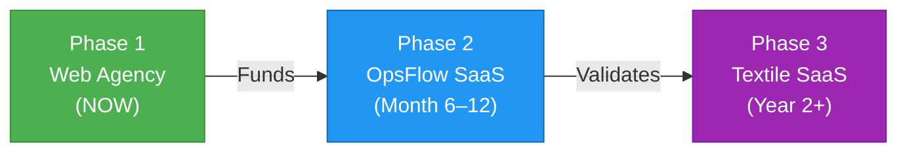
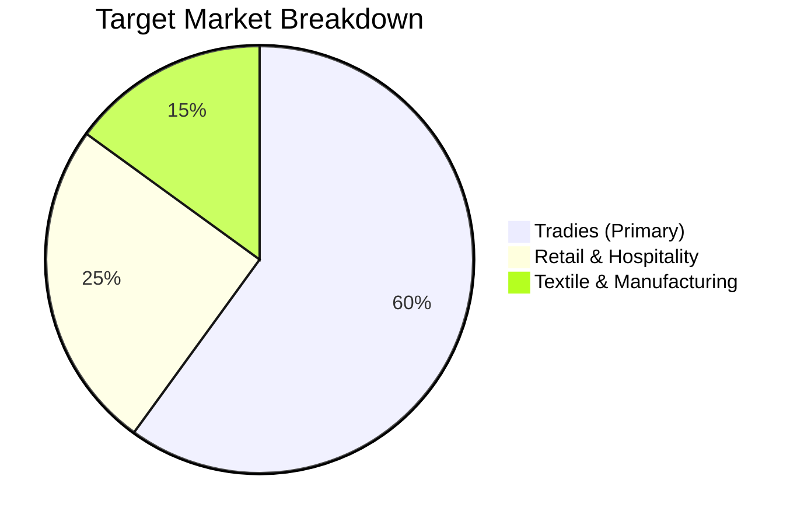
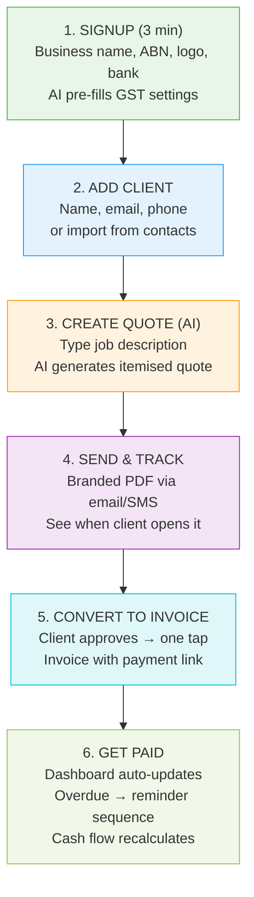
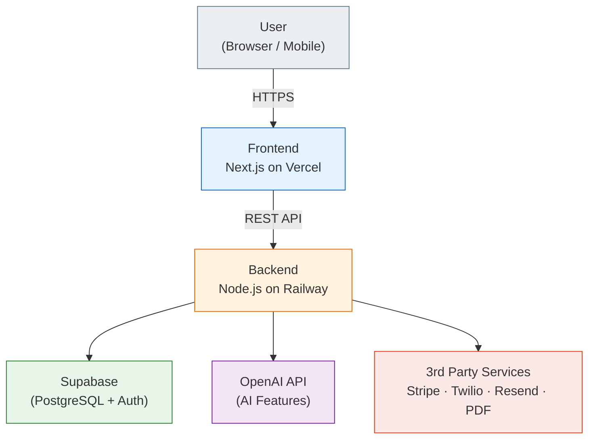
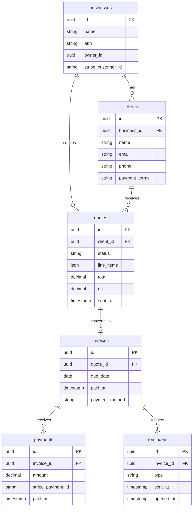
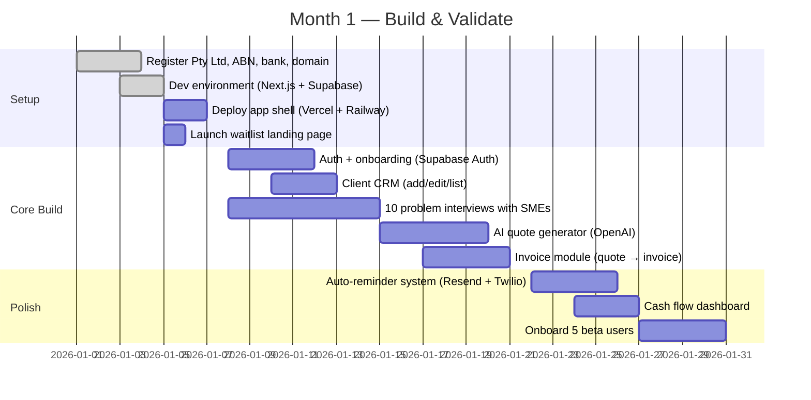

<div align="center">

# OpsFlow

**AI-Powered Quoting, Invoicing & Cash Flow for Australian SMEs**

[]()
[]()
[]()

*Turn a job description into a quote, a quote into an invoice, and an invoice into a cash flow forecast — in 60 seconds.*

</div>

---

## Table of Contents

- [Founder Context](#founder-context)
- [The Master Plan](#the-master-plan--3-phases)
- [Phase 1 — Web Agency](#phase-1--web-agency-now)
  - [Value Proposition](#value-proposition)
  - [Team Structure](#team-structure)
  - [Pricing](#pricing)
  - [Go-To-Market](#go-to-market)
  - [Legal & Business Setup](#legal--business-setup)
- [Phase 2 — OpsFlow SaaS](#phase-2--opsflow-saas-month-612)
  - [Core Concepts](#core-concepts)
  - [Target Market](#target-market)
  - [Competitor Landscape](#competitor-landscape)
  - [MVP Features](#mvp-features)
  - [User Flow](#user-flow)
  - [UI/UX Structure](#uiux-structure)
  - [Tech Stack](#tech-stack)
  - [System Architecture](#system-architecture)
  - [API Endpoints](#api-endpoints)
  - [Database Schema](#database-schema)
  - [AI Integration](#ai-integration)
  - [Monetization](#monetization)
  - [Revenue Projections](#revenue-projections)
- [Execution Roadmap](#execution-roadmap)
- [Risks & Mitigations](#risks--mitigations)
- [Strategist Notes](#strategist-notes--hard-earned-principles)
- [Quick Reference — First Steps](#quick-reference--first-steps-this-week)

---

## Founder Context

| | |
|---|---|
| **Founder** | Suju |
| **Background** | Tech/software + business/sales |
| **Family Business** | Sanjay Textile — textile manufacturing & trading, Lalitpur, Nepal |
| **Role** | Next in line to inherit and modernise the business |
| **Key Advantage** | Deep South Asian textile supply chain knowledge |
| **Early Team** | 4–5 people (IT student, IT hardware, marketing student + others) |
| **Target Market** | Australia (primary) · Nepal/South Asia (secondary via SaaS) |
| **Ambition** | Build a multi-million dollar company from the ground up |

---

## The Master Plan — 3 Phases

> [!IMPORTANT]
> Most founders try to do all three at once and fail at all three. The sequencing is critical. **Phase 1 funds Phase 2. Phase 2 validates Phase 3. Do not skip steps.**



| Phase | What | Revenue Model | Goal |
|:-----:|------|---------------|------|
| **1** | Web agency for Australian SMEs | Project fees + retainers | $4K–$15K AUD/mo in 6 months |
| **2** | OpsFlow: AI quoting, invoicing & cash flow | $49–$99/mo subscription | $4K MRR by Day 90 of launch |
| **3** | Textile ERP for South Asian businesses | SaaS subscription | Expand into verified niche |

---

## Phase 1 — Web Agency (NOW)

### Value Proposition

> You are **NOT** selling websites. You are selling **more customers and more revenue** for businesses.

**The pitch:**
> *"If my website gets you just 5 extra customers a month, each spending $200 — that's $1,000 extra per month. My website costs $3,000 once. It pays for itself in 3 months."*

| Business Type | Before | After | Extra Revenue |
|:---|:---|:---|---:|
| Restaurant | Walk-ins only | Online bookings + menu | +$3K–8K/mo |
| Tradie | Word of mouth | Google search visibility | +$5K–15K/mo |
| Retail shop | Foot traffic only | Online store + local SEO | +$2K–10K/mo |

### Team Structure

> [!WARNING]
> Do NOT let developers do sales. Do NOT let the founder do all the coding. Specialise from day one, even if it's uncomfortable.

| Role | Owner | Responsibility |
|:---|:---|:---|
| CEO | Suju | Sales, client relationships, strategy, pitching |
| Lead Developer | — | Backend architecture, project delivery, tech decisions |
| Frontend / UI | — | Design, website builds, visual identity |
| Mobile Developer | — | iOS/Android app builds for premium clients |
| Marketing | — | Social media, lead generation, client outreach |

### Pricing

<details>
<summary><strong>Website Packages</strong></summary>

| Package | Scope | Price (AUD) |
|:---|:---|---:|
| **Starter** | 5-page static site, mobile responsive | $2,500–$4,000 |
| **Business** | 10-page dynamic site, CMS, contact forms | $5,000–$9,000 |
| **Premium** | Custom design, booking/ordering system, integrations | $10,000–$20,000+ |

</details>

<details>
<summary><strong>Mobile App Packages</strong></summary>

| Package | Scope | Price (AUD) |
|:---|:---|---:|
| **MVP App** | One platform (iOS or Android), core features | $15,000–$25,000 |
| **Full App** | Both platforms, backend, admin dashboard | $30,000–$60,000+ |

</details>

<details>
<summary><strong>Monthly Retainers — Your Recurring Revenue Engine</strong></summary>

| Plan | Included | Price/Month (AUD) |
|:---|:---|---:|
| **Basic Care** | Hosting, updates, bug fixes | $300–$600 |
| **Growth** | + SEO, content updates, analytics | $800–$1,500 |
| **Full Partner** | + Ads management, monthly strategy call | $2,000–$4,000 |

> [!TIP]
> Always push clients onto retainers after delivery. **5 clients × $800/month = $4,000 MRR** before you do any new work. This is how agencies become sustainable.

</details>

### Go-To-Market

**Step 1 — Build your portfolio website** (your #1 sales weapon)

- [x] Bold hero headline: *"We build websites & apps that actually make you money"*
- [ ] Case studies (use Sanjay Textile as pilot — show before/after)
- [ ] Industry-specific landing pages (Restaurants / Tradies / Retail)
- [ ] Transparent pricing page
- [ ] Live chat or instant quote form
- [ ] Video or animation (separates you from 90% of local agencies)

> Build on **Next.js** or **Webflow**

**Step 2 — Niche your pitch by industry**

Don't say *"we build websites."*
Say *"we build websites for Melbourne restaurants that want more online orders."*

**Acquisition Channels:**

| Channel | Strategy | Priority |
|:---|:---|:---:|
| Instagram cold DM | Target restaurants/tradies by hashtag + location | :red_circle: High |
| LinkedIn outreach | 3-line personalised message to business owners | :red_circle: High |
| Google Business Profile | "web agency near me" searches | :red_circle: High |
| Referral program | 10% off next project per referral | :yellow_circle: Medium |
| TikTok content | Educate: "5 things your restaurant website must have" | :yellow_circle: Medium |

### Legal & Business Setup

| Task | Tool | Cost (AUD) |
|:---|:---|---:|
| Register Pty Ltd | ASIC (asic.gov.au) | ~$576 |
| Get ABN | ABR (abr.gov.au) | Free |
| Business bank account | ANZ or Wise Business | Free |
| Domain (.com.au) | Namecheap / Crazy Domains | ~$20/yr |
| Client contracts | LawPath or Sprintlaw | ~$200–400 |
| Virtual office (AU address) | Regus | ~$50/mo |

<details>
<summary><strong>Essential Contract Clauses</strong></summary>

- IP ownership stays with agency until full payment received
- 50% deposit upfront before any work begins
- Late payment penalty: 1.5%/month on overdue amounts
- NDA for client business information

</details>

---

## Phase 2 — OpsFlow SaaS (Month 6–12)

### Core Concepts

<details>
<summary><strong>What is a Quote?</strong></summary>

A price estimate sent to a client **before** work begins.

```
Fix hot water system:
├── Labour: 3 hrs × $100 .............. $300
├── Parts (Rinnai 26L unit) ........... $150
├── GST (10%) .......................... $45
└── TOTAL ............................. $495
```

**Quote** = "here's what it'll cost" → **Invoice** = "the work is done, please pay"

</details>

<details>
<summary><strong>Automated Payment Chase</strong></summary>

| Timeline | Action |
|:---|:---|
| Invoice due | Professional email with payment link |
| +7 days | Auto email reminder (polite) |
| +14 days | Auto email reminder (firmer tone) |
| +30 days | Auto SMS to their phone |
| Still unpaid | Flagged as **HIGH RISK** on dashboard |

**Legal backstop:** Approved quote = binding agreement in Australia. VCAT/Small Claims handles disputes under $15K. Late fees enforceable if in terms upfront.

</details>

### Target Market



| Segment | Size | Pain Point | Why OpsFlow Wins |
|:---|:---|:---|:---|
| **Tradies** (primary) | 350,000+ in AU | Quote via text, lose $K from unpaid invoices | Mobile-first, AI quotes |
| **Retail & Hospitality** | Cafes, boutiques (1–15 staff) | Need inventory-linked invoicing, can't afford enterprise | Simple + affordable |
| **Textile & Manufacturing** | Sanjay Textile as pilot | Track inventory in spreadsheets | Deep domain knowledge = moat |

### Competitor Landscape

| Competitor | Strength | Weakness | $/mo (AUD) |
|:---|:---|:---|---:|
| Xero | Full accounting, bank feeds | Too complex for micro SMEs | $32–115 |
| MYOB | AU-first, payroll strong | Legacy UI, steep learning curve | $27–150 |
| Tradify | Great for tradies, job mgmt | No AI, no cash flow forecasting | $49–99 |
| ServiceM8 | Excellent mobile, tradie-focused | Weak invoicing, no supplier tools | $29–349 |
| Rounded | Simple freelancer invoicing | No inventory, no team, no AI | $15–30 |

> [!NOTE]
> **The gap:** No competitor has meaningful **AI + inventory + invoicing** under $100/month on a mobile-first platform built for Australia.

### MVP Features

| Feature | Description | Status |
|:---|:---|:---:|
| AI Quote Builder | Job description → itemised quote with GST | Core |
| One-Click Invoicing | Approved quote → invoice in one tap | Core |
| Auto Payment Reminders | SMS + email at 7/14/30 days overdue | Core |
| Cash Flow Dashboard | Visual 30/60/90 day forecast | Core |
| Client CRM | Client database with job history | Core |
| Business Health Score | AI weekly revenue + risk snapshot | Phase 2 |
| Inventory Management | Stock tracking linked to invoices | Phase 2 |
| Supplier Management | Supplier orders & delivery tracking | Phase 2 |
| Payroll Integration | Connect to employment records | Phase 3 |
| ATO Direct Lodgement | Lodge BAS directly from app | Phase 3 |

### User Flow



### UI/UX Structure

| Screen | Purpose | Key Element |
|:---|:---|:---|
| **Dashboard** | Business pulse at a glance | Cash flow graph + overdue alerts |
| **Quotes** | Create, send, track | AI input box at top |
| **Invoices** | All invoices + actions | Filter: All / Paid / Overdue |
| **Clients** | CRM — list & history | Timeline view per client |
| **Cash Flow** | 30/60/90 day forecast | Bar chart + risk flags |
| **Reports** | GST summary, monthly revenue | Export to PDF for accountant |
| **Settings** | Business info, branding, bank | Logo upload, payment terms |

### Tech Stack

| Layer | Technology | Why |
|:---|:---|:---|
| Frontend | **Next.js 14** (React) | SEO-friendly, fast, great ecosystem |
| Styling | **Tailwind CSS** + **shadcn/ui** | Build beautiful UI fast |
| Backend | **Node.js** + Express / Hono | Same language as frontend |
| Database | **PostgreSQL** via Supabase | Relational DB for financial data + free tier |
| Auth | **Supabase Auth** | Email + Google login out of the box |
| AI | **OpenAI GPT-4o** API | Quote generation, forecasting, alerts |
| File Storage | **Supabase Storage** | PDF invoices, logo uploads |
| Email | **Resend** | Automated reminders |
| SMS | **Twilio** | Payment reminders via SMS |
| Payments | **Stripe** | Subscription billing + payment links |
| PDF | **React-PDF** / Puppeteer | Branded invoice/quote PDFs |
| Frontend Hosting | **Vercel** | Free tier, instant deploys |
| Backend Hosting | **Railway** | Free tier, simple deploys |
| Analytics | **PostHog** | User behaviour tracking |

> **Cost at MVP stage:** ~AUD $0–50/month (all services have generous free tiers)

### System Architecture



**Data flow:**
1. User opens app → **Next.js frontend** on Vercel
2. Frontend calls **backend API** on Railway
3. Backend validates request, checks auth, applies business rules
4. Backend queries **Supabase/PostgreSQL** for data
5. If AI needed → backend calls **OpenAI API**
6. Response returns → frontend updates UI
7. **Background jobs** (Twilio/Resend) fire reminders on schedule

### API Endpoints

| Endpoint | Method | Description |
|:---|:---:|:---|
| `/api/auth/signup` | `POST` | Create account, trigger onboarding |
| `/api/quotes` | `POST` | Create quote (AI if description provided) |
| `/api/quotes/:id/send` | `POST` | Send quote to client, start tracking |
| `/api/quotes/:id/approve` | `POST` | Client approves → auto-creates invoice |
| `/api/invoices/:id/remind` | `POST` | Manually trigger payment reminder |
| `/api/invoices/overdue` | `GET` | All overdue invoices + days outstanding |
| `/api/cashflow/forecast` | `GET` | AI-powered 90-day prediction |
| `/api/ai/generate-quote` | `POST` | Text in → structured quote out |
| `/api/reports/gst` | `GET` | GST summary for date range → PDF |

### Database Schema



### AI Integration

<details>
<summary><strong>1. Quote Generation (Core Feature)</strong></summary>

```
INPUT:  "Replace hot water system, 4 hours labour, Rinnai 26L unit"
          │
          ▼
PROCESS:  GPT-4o extracts:
          ├── Line items with quantities
          ├── Suggested Australian market prices
          ├── Auto-calculates GST (10%)
          └── Formats into professional quote structure
          │
          ▼
OUTPUT:  Fully structured, editable quote ready to send
```

</details>

<details>
<summary><strong>2. Cash Flow Prediction</strong></summary>

- Analyses historical invoice patterns (seasonal, client payment habits)
- Generates 90-day forecast with confidence intervals
- Highlights high-risk periods before they become crises

</details>

<details>
<summary><strong>3. Risk Alerts</strong></summary>

Flags clients showing late-payment patterns before escalation.

> *"Client X has paid late 3 months in a row — consider requiring a deposit"*

</details>

<details>
<summary><strong>4. Weekly Business Summary</strong></summary>

Auto-generated Monday morning email:

> *"You earned $8,400 last week. 2 invoices overdue totalling $3,200. Busiest service: hot water repairs."*

</details>

### Monetization

| Tier | Price/mo | Features |
|:---|---:|:---|
| **Starter** | FREE | 5 quotes, 5 invoices, 1 user, basic dashboard |
| **Professional** | AUD $49 | Unlimited quotes/invoices, AI quotes, auto reminders, cash flow, 3 users, GST reports |
| **Business** | AUD $99 | Everything + inventory, supplier mgmt, 10 users, custom branding, API access |

> [!TIP]
> **Annual plan = 2 months free.** Increases cash flow and reduces churn significantly.

### Revenue Projections

| Milestone | Users | Avg Rev | MRR (AUD) | Annual Run Rate |
|:---:|---:|---:|---:|---:|
| Month 3 | 20 | $49 | $980 | $11,760 |
| Month 6 | 75 | $52 | $3,900 | $46,800 |
| Month 12 | 200 | $58 | $11,600 | $139,200 |
| Month 18 | 500 | $62 | $31,000 | $372,000 |
| Month 24 | 1,200 | $65 | $78,000 | $936,000 |

---

## Execution Roadmap

### 30-Day Plan — Build & Validate



### 60-Day Plan — Launch & First Revenue

**Days 31–45**
- Polish all core flows based on beta feedback
- Integrate Stripe billing (Free / $49 / $99 tiers)
- Launch on Product Hunt (Tuesday, brief network for first 2hrs)
- Post on Reddit: r/aussmallbusiness, tradie Facebook groups

**Days 46–60**
- Convert beta users to paid (50% off first 3 months)
- Launch referral program (1 month free per paid referral)
- Cold DM campaign: 100 DMs/week to tradies on Instagram
- **Target: 20 paying customers = ~$980 MRR**

### 90-Day Plan — Scale & Double Down

**Days 61–75**
- Analyse which channel drives lowest CAC
- Build inventory module if requested by users
- Approach 3 accountants with free partner dashboards

**Days 76–90**
- **Target: 75 paying customers = ~$4,000 MRR**
- Hire part-time marketer (equity + small salary) if MRR allows
- Publish "90-day journey" post on LinkedIn/X

---

## Risks & Mitigations

| Risk | Level | Mitigation |
|:---|:---:|:---|
| Financial data breach | :red_circle: HIGH | Supabase RLS, Stripe for card data, pen testing from Month 6 |
| AI hallucination in quotes | :yellow_circle: MED | Always show AI output as editable draft, human review before send |
| Xero builds this feature | :yellow_circle: MED | 50% cheaper, 10x simpler — Xero won't cannibalise their complex product |
| Low willingness to pay | :red_circle: HIGH | Frame as ROI: "recover one late invoice and software pays for itself" |
| Churn (seasonal biz) | :yellow_circle: MED | Pause plans instead of cancellation, push annual plans |
| Mobile perf on old phones | :yellow_circle: MED | Budget under 200KB initial load, test on 4G throttled |

---

## Strategist Notes — Hard-Earned Principles

> *Things that take most founders 5 years to learn the hard way.*

<details>
<summary><strong>On Building</strong></summary>

> "Talk to 5 users every week. The biggest risk is building the wrong thing."

> "Ship MVP in 8 weeks. Real users reveal real problems you cannot predict from a whiteboard."

> "Launch fast, iterate faster. A working product in market beats a perfect product in development every single time."

</details>

<details>
<summary><strong>On Money</strong></summary>

> "Keep burn rate near zero for 6 months. Do not hire until $20K MRR."

> "Retainers over projects. One client on $800/month is worth more than a $3,000 one-off."

> "Annual plans change everything. A $470 upfront client is 12x less likely to churn."

</details>

<details>
<summary><strong>On Sales</strong></summary>

> "You are not selling websites. You are selling more customers, more revenue, and less stress."

> "The best sales call is a problem interview. Walk in curious, not pitching."

> "Niche down to win. 'We build websites' loses to 'we build websites for Melbourne restaurants that want more online orders' every time."

</details>

<details>
<summary><strong>On Strategy</strong></summary>

> "Sequence is everything. Phase 1 funds Phase 2. Phase 2 validates Phase 3."

> "Your South Asian textile background is a competitive moat. No Australian agency understands that supply chain like you do."

> "Build in public. Share progress on LinkedIn/X weekly. It builds audience, trust, accountability, and deal flow simultaneously."

</details>

---

## Quick Reference — First Steps This Week

| When | Action |
|:---|:---|
| **Today** | Read this document end to end |
| **Day 1** | Register ASIC Pty Ltd → Get ABN → Open business bank account |
| **Day 2–3** | Book 10 problem interviews with local SMEs/tradies |
| | Ask: *"How do you send quotes?"* + *"What happens when clients don't pay?"* |
| **Day 4–5** | Buy domain → Set up business email → Assign team roles |
| **Week 2** | Build portfolio/waitlist website |
| | Headline: *"We build websites that get you more customers"* |
| **Week 3–4** | Start cold outreach — 50 DMs on Instagram |
| | *"Hey [Name], I noticed your website — we help [industry] businesses get more customers online. Mind if I share what we'd do differently?"* |
| **Month 1 Goal** | **1 paying client.** Even at $2,500 — it proves the model. |

---

<div align="center">

**This document is a living blueprint. Update it as the business evolves.**

*Authored by a Senior Startup Strategist · 20+ Years Experience*
*Last Updated: March 2026 · Version 1.0*

</div>
